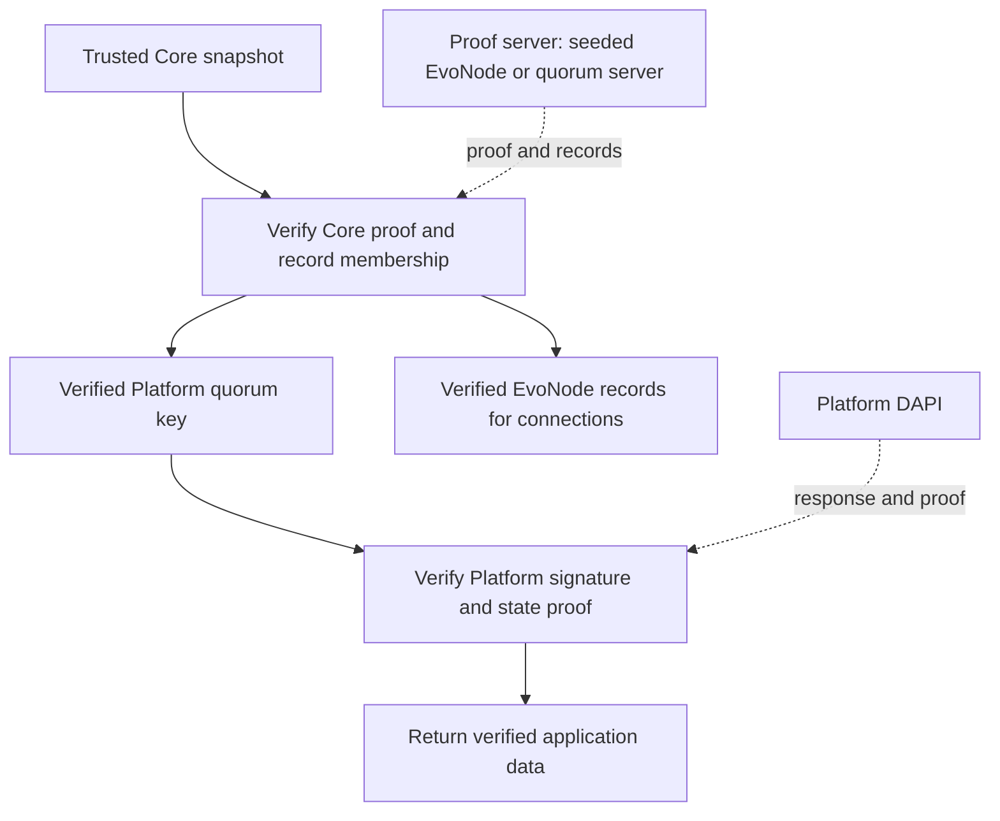
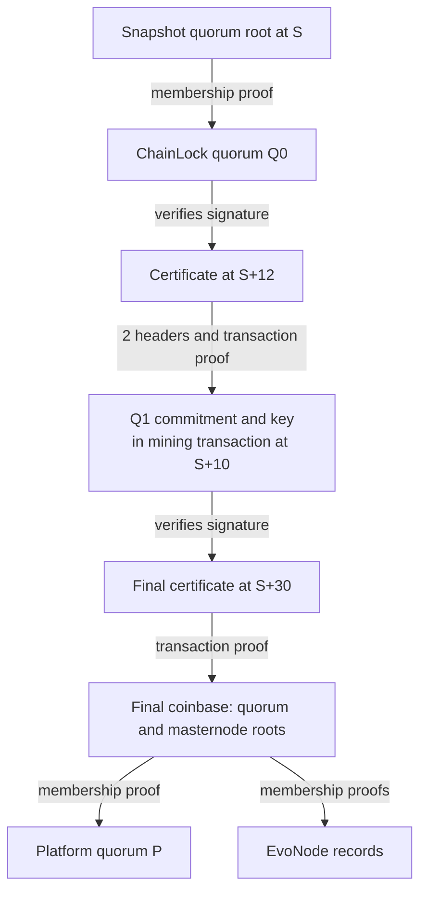
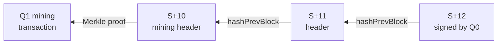

<pre>
  DIP: pasta-compact-quorum-proofs
  Title: Compact Quorum Proof Chains for Trustless Platform Verification
  Author(s): PastaPastaPasta
  Special-Thanks:
  Comments-Summary: No comments yet.
  Status: Draft
  Type: Standard
  Created: 2026-01-17
  License: MIT License
</pre>

## Table of Contents

1. [Abstract](#abstract)
1. [Motivation](#motivation)
1. [How It Works](#how-it-works)
1. [Trust Model](#trust-model)
1. [Worked Example](#worked-example)
1. [Wire Format](#wire-format)
1. [Verification](#verification)
1. [Construction and Serving](#construction-and-serving)
1. [SDK Integration](#sdk-integration)
1. [Size and Resource Limits](#size-and-resource-limits)
1. [Validation](#validation)
1. [Security Considerations](#security-considerations)
1. [Copyright](#copyright)

## Abstract

This proposal lets an SDK verify Platform quorum keys and EvoNode records using
ordinary Dash signatures and Merkle proofs. The SDK starts with a trusted Core
snapshot included in its release. A server supplies a compact proof connecting
that snapshot to a newer Core block, along with the requested records and proofs
that they belong to that block's quorum or masternode list.

The SDK checks this evidence locally, then uses the verified quorum key to check
Platform responses. It does not need to trust the server supplying the proof.
The design uses existing Dash consensus rules and requires no trusted setup.

## Motivation

An SDK needs up-to-date Platform quorum keys to verify responses. Asking a server
for those keys requires trusting that server unless the SDK can check where the
keys came from.

A small, fixed Core snapshot gives the SDK a trusted starting point. Compact
proofs let it verify newer keys without downloading and validating every Core
block. The intended history window is three to twelve months. Both the proof
size and the verifier's contribution to the SDK download matter.

## How It Works

The proof builds on three existing Dash features:

* [DIP-0004](dip-0004.md): coinbase transactions contain Merkle roots for the
  simplified masternode list and active quorum list.
* [DIP-0006](dip-0006.md): a quorum commitment records a quorum's identity, public
  key, and membership information. A quorum mining transaction includes this
  commitment in a Core block.
* [DIP-0008](dip-0008.md): a ChainLock is a quorum signature identifying a Core
  block at a particular height.

A **Merkle root** is a single hash representing a list of records. A **Merkle
path** proves that one record belongs to that list without sending the whole list. In this proposal, a
**certificate** contains a block header, its height, and its ChainLock signature.

The proof follows this sequence:

1. Prove that an initial ChainLock quorum belongs to the snapshot's quorum list.
2. Use that quorum's key to verify a certificate covering the mining transaction
   of another ChainLock quorum. That proves the next key. Repeat as needed;
   each change of quorum is called a **handoff**.
3. Use the last ChainLock quorum's key to verify a certificate for the target
   block. Prove that the block contains a coinbase transaction with the final
   quorum-list and masternode-list roots.
4. Use those roots to check the requested Platform quorum and EvoNode records.

If a quorum's mining block has no usable ChainLock, a later certificate can
cover it through consecutive block headers. Only these short gaps need headers;
the proof does not include every block since the snapshot.

## Trust Model

The application must obtain its starting snapshot independently of the proof
server, for example by including it in the SDK release. The snapshot contains:

* Network (0 mainnet, 1 testnet).
* Core height and block hash.
* Simplified masternode-list Merkle root.
* Active quorum-list Merkle root.

The snapshot in a proof MUST match all of these fields. A valid proof from a
server-chosen snapshot is not sufficient. After verification, the target block
and its roots can become the checkpoint for the next proof.

This proposal supports mainnet and testnet only.

The design assumes that ChainLock quorums whose keys the proof establishes do
not sign false certificates, even after those quorums leave the active set. The
proof checks their signatures, but does not repeat distributed key generation
(DKG), validate all Core consensus rules, or reconstruct which quorum was
eligible to sign each block. Proving that a key belongs to a quorum list does
not, by itself, prove that the quorum is still eligible to sign.

The client verifies both the Core evidence and the Platform response:



Solid arrows show what each check depends on. Dashed arrows show network inputs
that the client must verify. These checks prove authenticity under the assumption
above. The client must also check that the data is recent enough for its needs.

## Worked Example

Suppose the trusted snapshot is at height `S`. Its quorum list contains ChainLock
quorum `Q0`, and the client requests Platform quorum `P` from a target block at
`S+30`. A proof with one handoff to ChainLock quorum `Q1` looks like this:



Q0 signs the block at `S+12`. That block links back through two headers to the
block at `S+10`, which contains Q1's mining transaction. The client can therefore
verify Q1's key and use it to check the final certificate at `S+30`.

Q0 and Q1 are ChainLock quorums. P is a separate Platform quorum, verified against
the final coinbase's quorum root. Merkle paths prove membership for Q0, Q1's
transaction, the final coinbase, and the requested records. Linked test vectors
are in [Validation](#validation).

The two headers connect the mining transaction to the signed block as follows.
Each header's `hashPrevBlock` field contains the X11 hash of the previous header:



No separate ChainLock for `S+10` or `S+11` is needed. If the mining block itself
has a usable certificate, the handoff carries zero ancestor headers. These extra
headers cover only the gap between a mining block and its certificate.

## Wire Format

The layouts below give fields in wire order. Integers are unsigned, fixed-width,
and little-endian; `u8`, `u16`, and `u32` mean 1, 2, and 4 bytes. Hashes are 32
bytes in Core wire order, reversed from the hex strings shown by RPCs.
Transactions and commitments embedded in the proof use their existing canonical
Core encoding, including CompactSize where that encoding requires it.

A `blob` is a length followed by that many bytes: `length:u32 || bytes[length]`.
A Merkle `path` gives the leaf's zero-based index, the number of leaves in the
tree, and the sibling hashes needed to calculate the root:

```text
index:u32 | leaf_count:u32 | sibling_count:u8 | siblings[32]...
```

A `certificate` is exactly 180 bytes:

```text
height:u32 | core_block_header[80] | Basic_BLS_signature[96]
```

The main proof is:

```text
magic[8] = ASCII "DASHNC02"
snapshot {
  network:u8 | height:u32 | block_hash[32]
  masternode_root[32] | quorum_root[32]
}
seed_commitment:blob | seed_membership:path
handoff_count:u16
handoffs[handoff_count] {
  certificate
  mining_transaction:blob | transaction_membership:path
  ancestor_count:u16 | ancestor_headers[80]...
}
final_certificate
final_coinbase:blob | coinbase_membership:path
```

`seed_commitment` is the initial ChainLock quorum's complete final commitment,
including its verification-vector hash and both embedded signatures.
`seed_membership` proves that the commitment's double-SHA256 hash belongs to the
snapshot's quorum root.

`ancestor_headers` are ordered oldest first, from the mining block through the
block just before the certificate's block. Zero ancestors means the certificate
signs the mining block itself. The mining height is calculated as certificate
height minus ancestor count; the server cannot choose it separately.

The server response contains the proof above, followed by the requested quorum
and masternode records. Each record includes a Merkle path to the appropriate
root in the final coinbase. This combined response is called the **bootstrap
response**:

```text
proof:blob
record_count:u8
records[record_count] {
  kind:u8                  # 0 quorum commitment; 1 simplified masternode entry
  consensus_leaf:blob
  membership:path
}
```

`consensus_leaf` contains the record's canonical Core bytes: the full commitment
for a quorum, or the bytes hashed by `CSimplifiedMNListEntry::CalcHash` for a
masternode. The masternode bytes exclude the version prefix used only in network
messages. The decoder must consume the entire record and reject ambiguous or
unsupported masternode encodings.

Seed, handoff, and requested quorum commitments MUST use Basic BLS version 3
(types 1, 2, 3, 4, 6) or rotation version 4 (type 5, index 0–31).
Each commitment has bit vectors identifying its signers and valid members. Both
vectors MUST have the size listed below and at least the threshold number of
set bits. Unused padding bits MUST be zero:

| Quorum type | Size | Threshold |
| --- | ---: | ---: |
| 1 | 50 | 30 |
| 2 | 400 | 240 |
| 3 | 400 | 340 |
| 4 | 100 | 67 |
| 5 | 60 | 45 |
| 6 | 25 | 17 |

Unknown types or versions, null quorum hashes, and noncanonical encodings are
rejected. Public keys and certificate signatures MUST be canonical, non-infinity
points in the correct BLS subgroups. The commitment's embedded signatures are
included in the bytes checked by the Merkle proof; the verifier does not repeat
their DKG signature checks.

## Verification

A verifier MUST perform the following checks. Any failed check rejects the proof
or bootstrap response.

1. **Check the encoding.** Enforce the [resource limits](#size-and-resource-limits)
   before allocating memory. Reject truncated data, trailing bytes, unknown tags,
   and a magic value other than `DASHNC02`.
2. **Check the starting snapshot.** All fields must match the application's
   trusted snapshot. Its height must exceed 1,987,776 on mainnet or 905,100 on
   testnet (v20 activation). Snapshot and certificate heights must be at most
   2,147,483,647. The snapshot block hash and quorum root must be nonzero.
3. **Verify the initial key.** Decode the seed commitment using the commitment
   rules above, including the public-key checks. Verify its Merkle path against
   the snapshot's quorum root.
4. **Verify each handoff's certificate.** Its height must exceed the previous
   certificate's height, or the snapshot height for the first handoff. The current
   signing commitment must have the network's ChainLock quorum type: 2 on mainnet,
   1 on testnet. Verify the Basic BLS signature using the current key and Dash's
   existing ChainLock request and signing hashes, which bind the certificate
   height, quorum identity, and X11 block hash.
5. **Verify the mining transaction.** Starting at the signed header, check that
   each `hashPrevBlock` equals the X11 hash of the preceding supplied header.
   Verify the transaction's Merkle path against the oldest supplied header's
   transaction root, or the signed header's root if there are no ancestors.
   The transaction index must be nonzero, and ancestor count must be less than
   certificate height. Require a complete, canonical v3 quorum-commitment
   transaction with no inputs or outputs, zero locktime, and a v1 payload whose
   height equals certificate height minus ancestor count.
6. **Continue with the next key.** Check the transaction's full, non-null quorum
   commitment using the commitment rules above. Its quorum identity must differ
   from the current one. Use its key for the next certificate. The mining block
   may predate the snapshot; the certificate must still advance as required in
   step 4.
7. **Verify the target block and coinbase.** The final certificate's height must
   exceed the last handoff's height, or the snapshot height if there are no
   handoffs, even when the caller's minimum height is zero. Check the last key's
   ChainLock quorum type and the final signature as in step 4. Verify the
   coinbase's Merkle path at transaction index zero against the signed header.
   Require a complete v3 coinbase transaction with one coinbase input, a scriptSig
   of 1–100 bytes, and 1–4,096 outputs. Its payload must be v3, with height equal
   to the signed height, `bestCLHeightDiff` less than that height, and a nonzero
   quorum root. Read the quorum and masternode roots from this payload.
8. **Check the requested height and records.** The final height must meet the
   caller's minimum. A bootstrap response must contain 1–16 records with nonempty
   leaves. For each record, calculate its double-SHA256 hash and verify its Merkle
   path against the corresponding final root. If a Platform quorum was requested,
   require exactly one quorum record matching its type (4 on mainnet, 6 on
   testnet) and hash. Before using an EvoNode address, require an unambiguously
   decoded record for a valid, confirmed high-performance masternode with a
   supported HTTPS endpoint.
9. **Use the results only after all checks pass.** Only then accept the new
   checkpoint, quorum key, and eligible EvoNode addresses. Verify the Platform
   response signature and GroveDB proof before returning application data or
   advancing the stored Platform height or signed time used for freshness checks.

Every Merkle path must have exactly the tree depth implied by its leaf count.
When a level has an odd number of nodes, the last node must use its own hash as
its sibling. Equal sibling hashes are rejected at all other positions.
Transaction and record leaves of exactly 64 bytes are rejected so that an
internal tree node cannot be mistaken for a leaf.

## Construction and Serving

A proof server supplies a proof from the requested checkpoint to a
ChainLock-signed block on its active chain, together with the requested records
and their Merkle paths. It MUST return an error if the historical evidence is
unavailable or it cannot construct a valid proof within the resource limits.
Every successful response MUST satisfy the verification rules above.

A ChainLock signature can be used as soon as it is available; there is no need to
wait for a later coinbase to include it. For a long gap, the client can verify
several proofs in sequence, using each verified target as the next checkpoint.

The Core RPC is:

```text
getquorumproofchain checkpoint_hash height=0 quorum_hash="" llmq_type=0 node_count=4
```

`height=0` selects the server's latest available ChainLock on its active chain.
A positive height is a minimum: the target must be at or above that height and
strictly above the checkpoint. `quorum_hash` and `llmq_type` request one
quorum record; `node_count` requests zero through fifteen eligible EvoNode
records. The result contains `proof_hex`, `bootstrap_hex`, and `target`.
`bootstrap_hex` is empty if no records were requested.

```text
verifyquorumproofchain checkpoint_object proof_hex minimum_height=0
```

`checkpoint_object` supplies all fields of the caller's independently trusted
snapshot. The verification RPC returns `valid` plus either the verified `target`
or an `error`. It must not obtain the trusted snapshot from server metadata.

DAPI and quorum servers expose the same HTTP interface:

```http
POST /proofs
Content-Type: application/json

{"checkpoint":"<RPC block hash>","height":1549547,
 "quorumHash":"<RPC quorum hash>","llmqType":6,"nodeCount":4}
```

A successful response contains the binary bootstrap response with content type
`application/octet-stream`. HTTP gzip compression is permitted. A server MUST
enforce this DIP's parameter bounds and response size limits after decompression.
On failure, it returns an HTTP error.

## SDK Integration

Mainnet and testnet SDKs use verified mode by default. Each release includes an
independently verified snapshot and seed addresses for finding proof servers.
The SDK can request proofs from seeded EvoNodes, quorum servers, or an explicitly
configured list of either. These servers must be reachable and able to obtain
the historical evidence needed for the proof.

Before using a Platform quorum key, the SDK MUST verify it from the trusted
snapshot or a previously verified checkpoint. It MUST then verify the Platform
response signature and state proof, for both reads and transaction results.
Verified EvoNode records supply addresses for further connections; knowing an
address does not establish a quorum's authority to sign.

Applications can explicitly select trusted mode. In that mode, the SDK accepts
quorum keys from a configured source without requiring the Core proof. This
choice does not itself disable Platform response proof verification. A failure
in verified mode MUST NOT silently switch the SDK to trusted mode.

## Size and Resource Limits

| Item | Maximum |
| --- | ---: |
| Proof or bootstrap HTTP response, after decompression | 1,048,576 bytes |
| Certificates, including final certificate | 4,096 |
| Ancestor headers across the whole proof | 4,096 |
| Merkle leaf count | 100,000 |
| Merkle siblings | 17 |
| Transaction blob | 100,000 bytes |
| Seed commitment blob | 1,024 bytes |
| Bootstrap records | 16 |
| Record leaf | 4,096 bytes |

These limits apply to each response. The amount of history that fits depends on
how often quorums change and which ChainLocks are available.

## Validation

The [Core test vector][core-vector] supplies a trusted checkpoint, proof bytes,
and expected target at testnet height 1,549,547. The proof is 3,469 bytes;
the [matching bootstrap response][rust-fixture] is 4,506 bytes with one quorum
record, one EvoNode record, and their Merkle paths. [Core tests][core-tests] and
[Rust tests][rust-tests] check valid proofs and reject altered or malformed ones.

[Archive measurements][archive-results] cover 90, 180, and 366 days on both
networks. [Native SDK integration tests][stack-results] verify live Platform
queries and year-long histories through Core and a quorum server. The year-long
bootstrap responses were 175,781 bytes on mainnet and 343,014 bytes on testnet
before compression. Each included one quorum record, four EvoNode records, and
their Merkle paths. These measurements are not worst-case size bounds or
guarantees of history coverage.

[core-vector]: https://github.com/PastaPastaPasta/dash/blob/9f67367df634/test/functional/data/quorum_proof.json
[core-tests]: https://github.com/PastaPastaPasta/dash/blob/378d0fb22c28/src/test/quorum_proofs_tests.cpp
[rust-fixture]: https://github.com/PastaPastaPasta/platform/blob/e243ea60c856/packages/rs-core-proof/tests/data/bootstrap.bin
[rust-tests]: https://github.com/PastaPastaPasta/platform/blob/e243ea60c856/packages/rs-core-proof/tests/verification.rs
[archive-results]: https://github.com/PastaPastaPasta/dash/blob/7e7be9bbf4b0/doc/benchmarks/quorum-proof-2026-09-09/README.md
[stack-results]: https://github.com/PastaPastaPasta/dash/blob/7e7be9bbf4b0/doc/benchmarks/quorum-proof-full-stack-2026-09-09/README.md

## Security Considerations

A server can withhold proofs or replay valid older proofs. An attacker
controlling all proof servers can also use up the client's request budget.
Verification proves authenticity under the trust model above; it does not prove
that the target is the newest block. Clients must enforce minimum heights and
Platform freshness checks using signed times and heights. Unverified metadata
must never advance those stored values.

If an attacker compromises enough historical quorum keys, they can forge a
certificate chain. This design relies on historical quorums remaining honest;
it does not independently check full Core state validity or each signer's
eligibility. Merely knowing a quorum key never authenticates a header: its
certificate and the preceding proof chain must pass verification.

Release snapshots must be independently verified and tied to the correct network.
Accepting a new snapshot from an unverified server response defeats the design.
Any saved verified state must remain tied to the trusted snapshot it came from
and retain the same integrity and network checks.

## Copyright

Copyright (c) 2026 PastaPastaPasta. Licensed under the MIT License.
