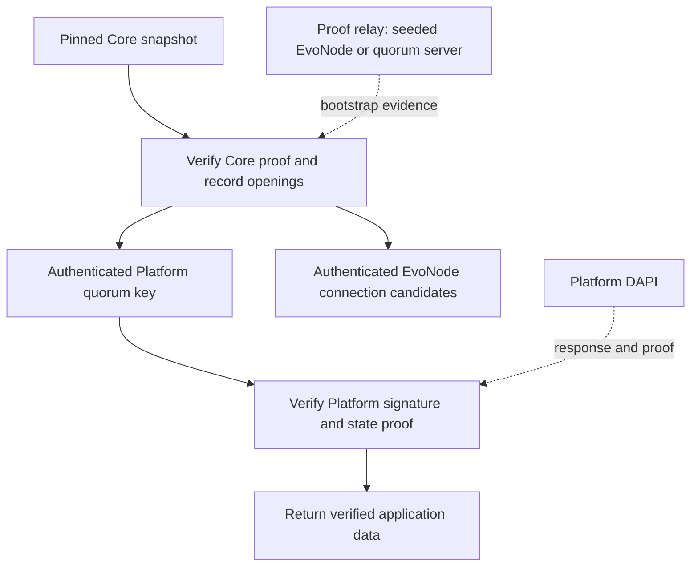
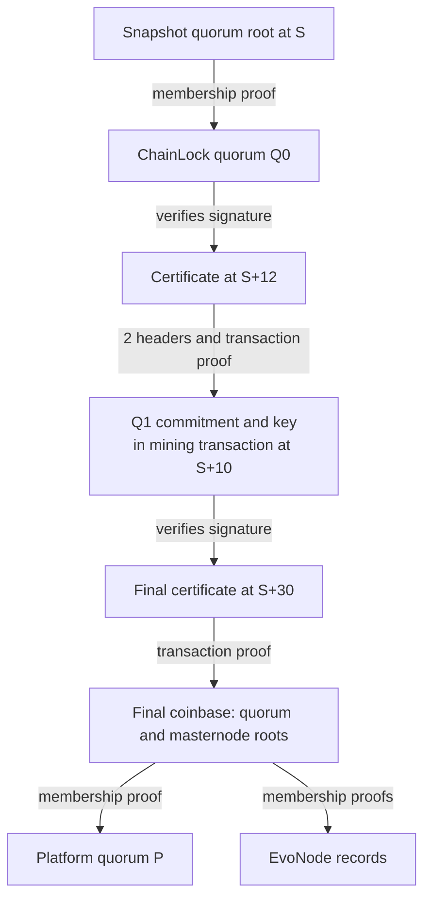
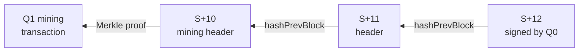

<pre>
  DIP: pasta-compact-quorum-proofs
  Title: Compact Quorum Proof Chains for Trustless Platform Verification
  Author(s): PastaPastaPasta
  Special-Thanks:
  Comments-Summary: No comments yet.
  Status: Draft
  Type: Standard
  Created: 2026-01-17
  License: MIT License
</pre>

## Table of Contents

1. [Abstract](#abstract)
1. [Motivation](#motivation)
1. [Protocol Foundations](#protocol-foundations)
1. [Trust Model](#trust-model)
1. [Wire Format](#wire-format)
1. [Verification](#verification)
1. [Construction and Serving](#construction-and-serving)
1. [Worked Example](#worked-example)
1. [SDK Integration](#sdk-integration)
1. [Size and Resource Limits](#size-and-resource-limits)
1. [Validation](#validation)
1. [Security Considerations](#security-considerations)
1. [Copyright](#copyright)

## Abstract

This proposal authenticates current Dash Core quorum keys and EvoNode records from
an application-supplied trusted snapshot. A relay provides ordinary ChainLock
certificates, quorum mining transactions, and Merkle paths. The SDK verifies them
locally before verifying Platform responses. Relays supply evidence and do not
supply trusted keys. The proof uses existing Dash blocks, commitments, signatures,
and consensus rules.

Each handoff authenticates the next quorum through its mining transaction.
When the mining block lacks a usable ChainLock, a later certificate authenticates
that block through consecutive X11 headers.

## Motivation

An SDK can distribute a small, fixed Core snapshot and network addresses with its
release, then acquire the evidence needed to authenticate newer Platform quorum
keys. The intended history window is three to twelve months. The proof and the
SDK verifier both contribute to download cost, so they must be measured together.

## Protocol Foundations

[DIP-0004](dip-0004.md) commits simplified masternode lists in coinbase transactions.
[DIP-0006](dip-0006.md) defines LLMQ commitments and
[DIP-0008](dip-0008.md) defines ChainLocks.

A mining transaction contains the complete next quorum commitment. A handoff
authenticates that transaction with a Merkle path to a ChainLock-authenticated
block. The final coinbase supplies the quorum and masternode roots used to
authenticate the requested records.

## Trust Model

The application independently fixes a snapshot containing:

* Network (0 mainnet, 1 testnet).
* Core height and block hash.
* Simplified masternode-list Merkle root.
* Active quorum-list Merkle root.

A response MUST exactly match this snapshot. A relay-provided snapshot MUST NOT
be promoted to trusted configuration merely because a proof is internally valid.
A successfully verified target can serve as the next session checkpoint.

This proposal supports mainnet and testnet only. Devnet and regtest are outside
its scope.

The design assumes historically authenticated ChainLock quorums do not sign false
certificates, including after leaving the active set. It proves a sequence of
statements by authenticated quorum keys. It does **not** independently reconstruct
DKG, full Core consensus, or the exact active signing-quorum selection for each
certificate. Membership of a key is not proof of its current signing authority.
These are deliberate constraints of this compact certificate trust model.

The snapshot is supplied independently; both network responses below remain
untrusted until the client verifies them:



The solid arrows show verification dependencies; dashed arrows show untrusted
network inputs. These checks establish authenticity under the trust model above;
the client also enforces its freshness policy.

## Wire Format

All proof framing integers are unsigned little-endian fixed-width integers.
Hashes are 32 bytes in Core serialization order, reversed from RPC display hex.
Nested transactions and commitments use their existing canonical Core consensus
serialization, including CompactSize where consensus requires it. There is no
protobuf or general-purpose object encoding on the proof wire.

A `blob` is `length:u32 || bytes[length]`. A `path` is:

```text
index:u32 | leaf_count:u32 | sibling_count:u8 | siblings[32]...
```

A `certificate` is exactly 180 bytes:

```text
height:u32 | core_block_header[80] | Basic_BLS_signature[96]
```

The main proof is:

```text
magic[8] = ASCII "DASHNC02"
snapshot {
  network:u8 | height:u32 | block_hash[32]
  masternode_root[32] | quorum_root[32]
}
seed_commitment:blob | seed_membership:path
handoff_count:u16
handoffs[handoff_count] {
  certificate
  mining_transaction:blob | transaction_membership:path
  ancestor_count:u16 | ancestor_headers[80]...
}
final_certificate
final_coinbase:blob | coinbase_membership:path
```

The seed is the complete final quorum commitment, including its vector hash and
**both** embedded signatures. Its double-SHA256 hash is opened in the snapshot's
quorum root. Embedded commitment signatures are included in the authenticated
serialization; this verifier does not re-execute their DKG validation.

Ancestor headers are ordered oldest first: mining block, then its descendants,
ending at the certificate's parent. Zero ancestors means the certificate signs
the mining block itself. The mining height equals certificate height minus
ancestor count. There is no independent relay-selected mining height.

The HTTP bootstrap envelope adds authenticated consensus records:

```text
proof:blob
record_count:u8
records[record_count] {
  kind:u8                  # 0 quorum commitment; 1 simplified masternode entry
  consensus_leaf:blob
  membership:path
}
```

A quorum leaf is the full commitment. A masternode leaf is exactly the
`CSimplifiedMNListEntry::CalcHash` preimage, excluding the network-only version
prefix. The decoder must consume the complete supported canonical serialization;
ambiguous or unsupported masternode encodings are rejected.

Seed, handoff, and requested quorum commitments MUST use Basic BLS version 3
(types 1, 2, 3, 4, 6) or rotation version 4 (type 5, index 0–31).
The signer and valid-member vectors MUST each have the type's exact size and at
least its threshold number of set bits, with zero unused padding bits:

| Quorum type | Size | Threshold |
| --- | ---: | ---: |
| 1 | 50 | 30 |
| 2 | 400 | 240 |
| 3 | 400 | 340 |
| 4 | 100 | 67 |
| 5 | 60 | 45 |
| 6 | 25 | 17 |

Unknown types or versions, null quorum hashes, and noncanonical encodings are
rejected. Public keys and certificate signatures MUST be canonical, non-infinity
points in the correct BLS subgroups. Embedded commitment signatures remain part
of the authenticated leaf; their DKG validity is not independently established.

## Verification

1. Enforce all framing limits before allocation. Reject truncation, trailing
   bytes, unknown tags, and a magic value other than `DASHNC02`.
2. Require exact equality with the application's trusted snapshot. The snapshot
   height MUST exceed 1,987,776 on mainnet or 905,100 on testnet (v20 activation).
   Snapshot and certificate heights MUST be at most 2,147,483,647; snapshot block
   hash and quorum root MUST be nonzero.
3. Parse the seed commitment canonically, require a nonzero subgroup-valid public
   key, and verify its membership in the snapshot quorum root.
4. For each handoff, require a strictly increasing certificate height and the
   network's ChainLock quorum type (2 mainnet, 1 testnet). Verify its Basic BLS
   signature using the current key and Dash's existing ChainLock request/signing
   hash construction, including the certificate height, quorum identity, and X11
   block hash.
5. Starting at that signed header, check every `hashPrevBlock` against the X11
   hash of the preceding supplied header. Verify the complete mining transaction
   against the oldest header's transaction root. Transaction index must be
   nonzero, and ancestor count MUST be less than certificate height. Require a
   canonical v3 quorum-commitment transaction with no inputs, outputs, or
   locktime, payload version 1, and the derived mining height.
6. Parse its full non-null commitment and install the authenticated next key.
   Reject a handoff to the same quorum identity. A mining block preceding the
   initial snapshot is permitted; the certificate height must still advance
   beyond the previous certificate or, for the first handoff, the snapshot.
7. Require the final certificate height to strictly exceed the last handoff's
   certificate height, or the trusted snapshot height when there are no handoffs,
   including when the caller's minimum target height is zero. Require the last
   key's commitment to have the network's ChainLock quorum type (2 mainnet,
   1 testnet), and verify the final certificate's Basic BLS signature using that
   key and the request/signing hash construction in step 4. Open transaction
   index zero, parse its complete v3 coinbase, and require coinbase payload height
   to equal the signed height. Require one coinbase input, a scriptSig of 1–100
   bytes, 1–4,096 outputs, a v3 payload, `bestCLHeightDiff` less than the signed
   height, and a nonzero quorum root. Extract both final roots.
8. Enforce the caller's minimum target height. For a bootstrap, require 1–16
   records with nonempty leaves. Verify every supplied record's double-SHA256
   leaf hash against its corresponding final root. If a Platform quorum was
   requested, require exactly one opening matching its type (4 mainnet,
   6 testnet) and hash. Before using an EvoNode endpoint, require an unambiguously
   decoded, valid, confirmed high-performance masternode record with a supported
   HTTPS endpoint.
9. Publish the new state, key, and eligible EvoNode endpoints only after the entire
   envelope succeeds. Then verify the Platform response signature and GroveDB
   proof before returning application data or advancing Platform freshness state.

Merkle verification consumes exactly the tree depth implied by leaf count. An
odd final node must use its own hash as the duplicate sibling. Equal siblings at
non-duplicate positions are rejected. Transaction and record leaves of exactly
64 bytes are rejected to prevent interpreting an internal tree node as a leaf.

## Construction and Serving

A producer supplies a proof from the requested checkpoint to a certified target
on its active chain, including the requested record openings. It MUST return an
error if the necessary historical evidence or a valid route within the resource
limits is unavailable. Each successful response MUST satisfy the verification
rules above. A ChainLock signature can be used before a later coinbase carries
it; coinbase inclusion of the signature itself is not required.

Multiple bounded proofs can advance an authenticated checkpoint over longer
gaps. This specification does not require a particular search algorithm, storage
index, or globally smallest proof.

The Core RPC is:

```text
getquorumproofchain checkpoint_hash height=0 quorum_hash="" llmq_type=0 node_count=4
```

`height=0` selects the producer's latest available ChainLock on its active chain.
A positive height is a minimum: the target must be at or above that height and
strictly above the checkpoint. `quorum_hash` and `llmq_type` request one
quorum opening; `node_count` requests zero through fifteen eligible EvoNodes.
The result contains `proof_hex`, `bootstrap_hex`, and `target`. The bootstrap
field is empty if no records were requested. Generation supports mainnet/testnet.

```text
verifyquorumproofchain checkpoint_object proof_hex minimum_height=0
```

The verification RPC takes all independently trusted snapshot fields and returns
`valid` plus either the authenticated `target` or an `error`. It does not consult
RPC metadata to obtain trust roots.

DAPI and quorum servers expose the same relay interface:

```http
POST /proofs
Content-Type: application/json

{"checkpoint":"<RPC block hash>","height":1549547,
 "quorumHash":"<RPC quorum hash>","llmqType":6,"nodeCount":4}
```

Success is the binary bootstrap envelope with content type
`application/octet-stream`; HTTP gzip compression is permitted. A server MUST
enforce the parameter bounds and decoded response limits in this DIP. Failure
returns an HTTP error, never trusted fallback keys.

## Worked Example

Suppose a snapshot at height `S` authenticates ChainLock quorum `Q0`. The client
requests Platform quorum `P` at height `S+30`. One possible proof is:



The first handoff carries two ancestor headers because its certificate is two
blocks after the mining transaction. Its derived mining height is `S+12−2`.
Merkle paths open Q0, Q1's transaction, the final coinbase, and the requested
records. Q0 and Q1 are ChainLock quorums; P is a separate Platform quorum whose
key is authenticated by the final root. See [Validation](#validation) for vectors.

The two-header bridge expands as follows. Each `hashPrevBlock` link points
from a checked header to the predecessor whose X11 hash it commits to:



No separate ChainLock for `S+10` or `S+11` is needed. If the mining block itself
has a usable certificate, the handoff carries zero ancestor headers. This bridge
covers only the gap from a mining block to its certificate; the proof does not
include every header between the snapshot and the final target.

## SDK Integration

Mainnet/testnet SDKs use verified mode by default, with independently pinned
release snapshots and untrusted seed addresses. Proof sources can be seeded
EvoNodes, quorum servers, or an explicitly supplied list of either. Authenticated
EvoNode records provide connection candidates; addresses never confer signing
authority.

Verified SDK operation requires reachable proof-serving endpoints that can obtain
the historical evidence required by the request.

Before using a Platform quorum key, the SDK MUST authenticate it from the trusted
snapshot or previously verified state. It MUST then verify the Platform response
signature and state proof, for both reads and transaction results.

Applications can explicitly select trusted mode, accepting quorum keys from a
configured source without the Core proof. This choice does not itself disable
Platform response proof verification. Failed verified mode MUST NOT silently
become trusted mode.

## Size and Resource Limits

| Item | Maximum |
| --- | ---: |
| Decoded proof or bootstrap HTTP response | 1,048,576 bytes |
| Certificates, including final certificate | 4,096 |
| Ancestor headers across the whole proof | 4,096 |
| Merkle leaf count | 100,000 |
| Merkle siblings | 17 |
| Transaction blob | 100,000 bytes |
| Seed commitment blob | 1,024 bytes |
| Bootstrap records | 16 |
| Record leaf | 4,096 bytes |

These limits bound individual requests, not the duration of history. Certificate
availability and quorum cadence determine achievable history per request.

## Validation

The [Core test vector][core-vector] supplies a trusted checkpoint, proof bytes,
and expected target at testnet height 1,549,547. The proof is 3,469 bytes;
the [matching bootstrap][rust-fixture] is 4,506 bytes with one quorum and one
EvoNode opening. [Core tests][core-tests] and [Rust tests][rust-tests] exercise
valid verification and rejection of altered or malformed evidence.

[Archive measurements][archive-results] cover 90, 180, and 366 days on both
networks. [Native SDK integration tests][stack-results] verify live Platform
queries and year-long histories through Core and a quorum server. The year-long
bootstraps were 175,781 bytes on mainnet and 343,014 bytes on testnet, each with
one quorum and four EvoNode openings, before compression. These observations are
not worst-case bounds or guarantees of history coverage.

[core-vector]: https://github.com/PastaPastaPasta/dash/blob/9f67367df634/test/functional/data/quorum_proof.json
[core-tests]: https://github.com/PastaPastaPasta/dash/blob/378d0fb22c28/src/test/quorum_proofs_tests.cpp
[rust-fixture]: https://github.com/PastaPastaPasta/platform/blob/e243ea60c856/packages/rs-core-proof/tests/data/bootstrap.bin
[rust-tests]: https://github.com/PastaPastaPasta/platform/blob/e243ea60c856/packages/rs-core-proof/tests/verification.rs
[archive-results]: https://github.com/PastaPastaPasta/dash/blob/7e7be9bbf4b0/doc/benchmarks/quorum-proof-2026-09-09/README.md
[stack-results]: https://github.com/PastaPastaPasta/dash/blob/7e7be9bbf4b0/doc/benchmarks/quorum-proof-full-stack-2026-09-09/README.md

## Security Considerations

An attacker controlling all relays can withhold evidence, replay sufficiently
recent valid evidence, or exhaust a client's bounded request budget. Successful
verification establishes authenticity under the trust model, not that the target
is the globally newest block. Platform signed-time/height freshness policy and
caller minimum heights are required. Unauthenticated metadata must not advance a
freshness ratchet.

The design does not protect against compromise of enough historical quorum keys
to forge this certificate chain. Stronger guarantees require a stronger trust
model or additional consensus evidence and have different size costs.

Snapshots are release trust material. Their hashes and roots require independent
release verification and network binding. Updating a snapshot from an unverified
HTTP response defeats the design. Persistent caches, if implemented, require the
same provenance and integrity protections as their original trust configuration.

No headers are treated as authenticated merely because a matching quorum key is
known. Every accepted statement is covered by the certificate chain under the
historical quorum honesty assumption above. Full state validity and exact signer
eligibility are deliberately outside this proof's statement.

## Copyright

Copyright (c) 2026 PastaPastaPasta. Licensed under the MIT License.
